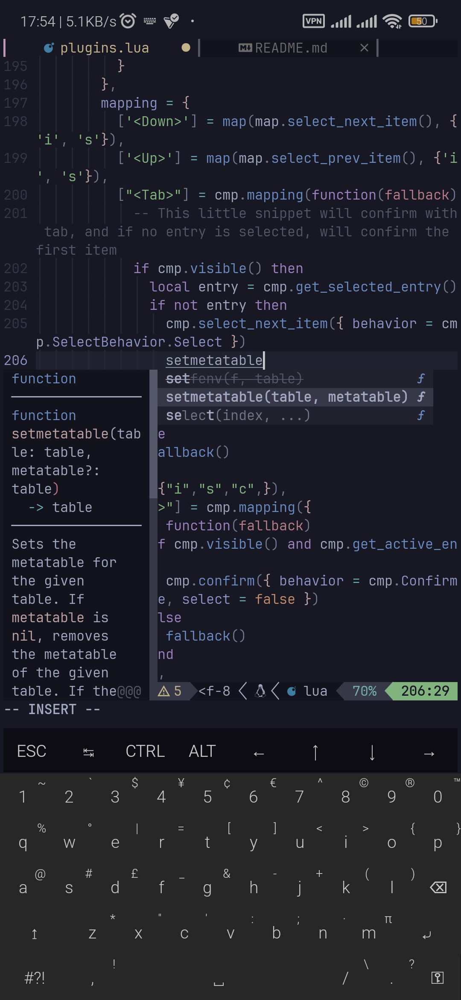
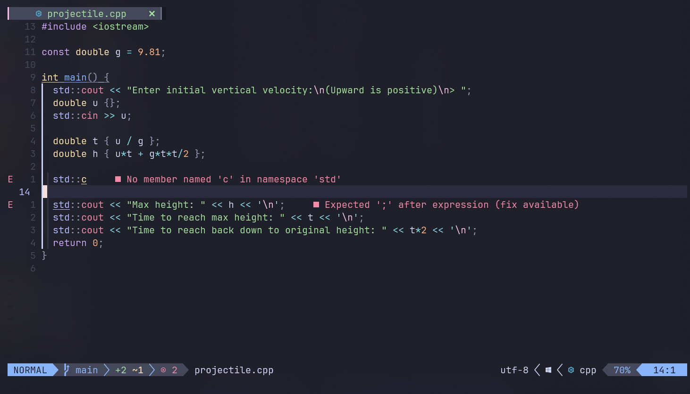

# nvim-config

## Description

This is my own personal nvim config.
I keep this as backup in case I wiped my config.

Intended for personal use (in termux and linux distros) but may work for others as well.

You are welcomed to fork and use my config.

There is no guarantee of stability or compatibility.
Everything may change at anytime.

## Screenshot





## Features

- modernish look (with catppuccin)
- autocompletion with lsp
- easy lsp install and setup with mason.nvim
- git interface for commits and conflict managing
- autosave
- telescope.nvim
- quick word jumping with leap.nvim
- ai autocompletion via codeium (non-termux)
- markdown preview

## Installing Lsps

`<ESC>:Mason<ENTER>` to enter Mason.

Select lsp and press `i` to install.
Lsp will be automatically setup.

### Notice Termux users

`clangd`, `rust_analyzer`, `lua_ls` from mason does not work with termux.

Instead, install from package manager, this config is already set to work with installed versions.

For clangd:

```sh
apt install clangd
```

For rust analyzer:

```sh
apt install rust-analyzer
```
For lua language server (`lua_ls`):

```sh
apt install lua-language-server
```

After installation, they should work automatically.

## Preview Markdown

`<ESC>:MarkdownPreview<ENTER>` to start preview

`<ESC>:MarkdownPreviewStop<ENTER>` to stop preview

`<ESC>:MarkdownPreviewToggle<ENTER>` to toggle preview

## Shortcuts

- `tt`: opens Telescope.nvim
- `ff`: opens nvim-tree
- `cf`: formats code
- `Alt-/`: word jump
- `Alt-Right`: accept codeium autocomplete
- `Alt-Up`: switch to next codeium autocomplete
- `Alt-Down`: switch to previous codeium autocomplete
- `Alt-Left`: cancel normal autocomplete

### Notice Termux users

codeium binary does not work with termux the last time I checked, hence plugin is disabled by default.

## Installation

```bash
mv ~/.config/nvim ~/.config/nvim.old
git clone https://github.com/wmartinmimi/nvim-config ~/.config/nvim
```

If Lazy shows error on first install, reopen nvim, run `:Lazy`, and run update (U).

If codeium complains about `^M`, run `fromdos` in the files with errors to convert from `crlf` to `lf`.

## Requires

- Nerdfont

Download a nerdfont, paste in ~/.termux, and rename to `font.ttf`.

- Ripgrep

Download ripgrep for fast regex.

```sh
apt install ripgrep
```

- Nodejs

Download nodejs for Mason.

```sh
apt install nodejs
```

## Command to exit nvim

`<ESC>:qa<ENTER>`

## License

MIT Licensed
