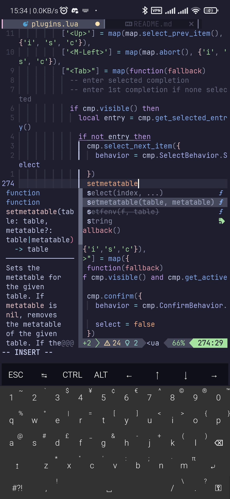

# nvim-config

## Description

This is my own personal nvim config.
I keep this as backup in case I wiped my config.

Intended for personal use (in termux and linux distros) but may work for others as well.

You are welcomed to fork and use my config.

There is no guarantee of stability or compatibility.
Everything may change at anytime.

## Screenshot




## Features

- mason for lsp installations
- modernish look (with catppuccin)
- autocompletion with lsp
- autosave
- telescope.nvim
- quick word jumping with flash.nvim
- ai autocompletion via codeium (non-termux)
- debugging support with nvim dap

## Adding Lsps

### Easy

Open `:Mason` and search for any desired lsp.
You could use `:LspInstall <lsp name>` as well.

### Advanced

Open `init.lua`, find `local servers = {}` near the start of file.

Add or remove lsp server names as desired.
lsp server names are from lspconfig.

*LSP servers must be installed separately and on $PATH.*

Run `:help lspconfig-all` to list all possible lsp integrations with some instructions on how to install them.

## Shortcuts

- `tt`: opens Telescope.nvim
- `ff`: opens nvim-tree
- `cf`: formats code

### Notice Termux users

codeium binary does not work with termux the last time I checked, hence plugin is disabled by default.

## Installation

```bash
mv ~/.config/nvim ~/.config/nvim.old
git clone https://github.com/wmartinmimi/nvim-config ~/.config/nvim
```

If Lazy shows error on first install, reopen nvim, run `:Lazy`, and run update (U).

### Notice WSL2 users

WSL2 may bug out on some git repo, where scripts complain about `^M`.

if so, run the following on the affected plugins in `~/.local/share/nvim/lazy`

```sh
git config core.autocrlf false
git reset --hard HEAD
```

## Requires

- Nerdfont (for pretty text icon)

Download a nerdfont, paste in ~/.termux, and rename to `font.ttf`.

## Command to exit nvim

`<ESC>:qa<ENTER>`

## License

MIT Licensed
